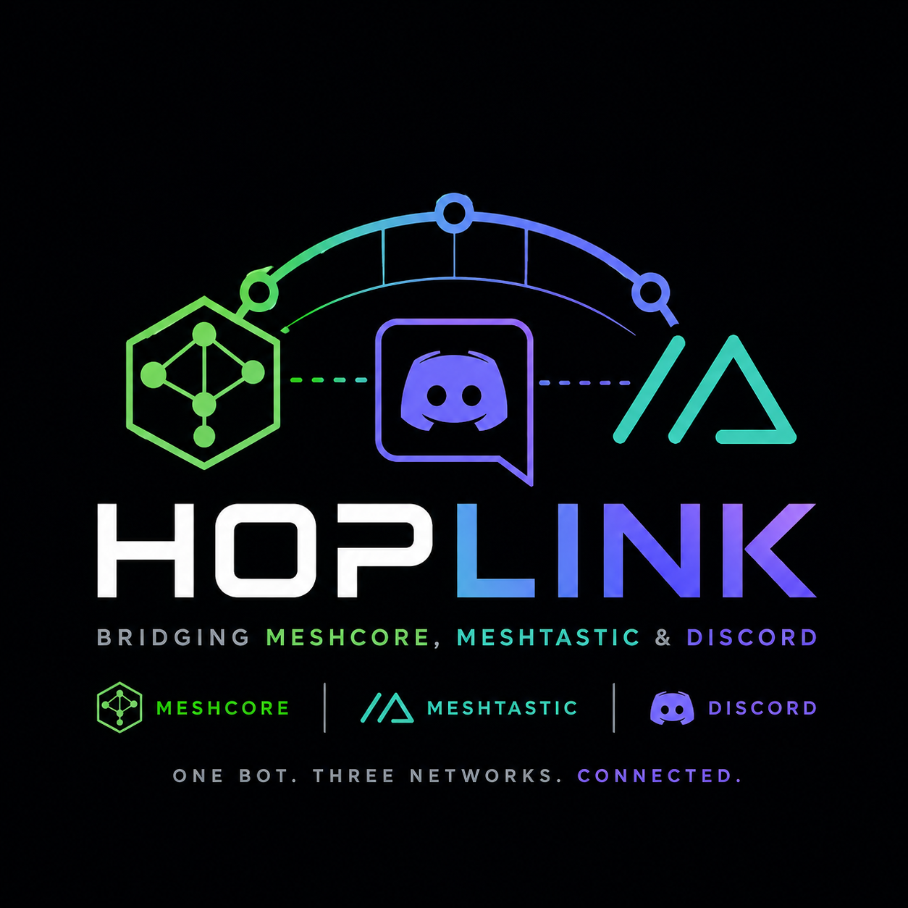

<p align="center">
  
</p>

# hoplink

> **Note:** This project is fully "vibe coded" — written conversationally
> with an AI coding assistant rather than by hand. It's tested against real
> hardware and has a real test suite, but review the code yourself before
> relying on it for anything important.

A bridge connecting [MeshCore](https://github.com/meshcore-dev/MeshCore),
[Meshtastic](https://meshtastic.org/), and Discord — relay between any two of
these, or all three at once. **Discord is entirely optional**: a bridge can
just as well relay purely between a MeshCore mesh and a Meshtastic mesh, with
no Discord channel involved at all.

- **Discord → mesh**: your Discord display name is embedded as the visible
  sender ("`Alice: hello`"), so people on the mesh know who's talking.
- **Mesh → Discord**: each node posts under its own name and a generated
  avatar (via a Discord webhook, so it looks like the node has its own
  Discord identity — not "the bridge bot said: ...").
- **Mesh → mesh**: MeshCore and Meshtastic can relay directly to each other,
  with or without Discord in the mix.
- Any bridge independently enables its MeshCore side, its Meshtastic side,
  and/or its Discord side — pick any two, or all three. A bridge with no
  Discord side needs both MeshCore and Meshtastic enabled (otherwise it has
  nothing to relay between); with Discord enabled, either mesh side alone is
  fine.
- Oversized outbound messages are rejected (not silently chunked forever)
  with a reply in Discord explaining why (Discord-side bridges only).
- `sender_format` controls how a relayed message's origin is shown on every
  *other* surface it lands on — e.g. a MeshCore message from "Alice" can show
  up as "Alice", "Alice (MC)", or "Alice (MeshCore)" on Discord and on
  Meshtastic, depending on the setting.
- **Sibling bridges**: if two (or more) bridges reference the same MeshCore
  channel and/or the same Meshtastic channel_name — e.g. bridging one mesh
  channel into two different Discord servers — a message landing on any one
  of them relays directly to every sibling's Discord channel too, not just
  its own. This is an immediate, same-process relay, not dependent on the
  message actually being heard back over RF.
- **Read-only sides**: any side of a bridge (`meshcore`, `meshtastic`, or
  Discord) can be marked read-only, so it only ever receives and never
  transmits — useful for a one-way monitoring feed.
- A whole bridge can be disabled (`enabled: false`) to keep a not-yet-finished
  or temporarily-unwanted entry in the config without it being built,
  connected to, or validated for completeness.

## How the two protocols differ here

- **MeshCore**: messages are sent as fully hand-composed raw RF packets
  (`CMD_SEND_RAW_PACKET`) — see `internal/meshcore`. A MeshCore "hashtag"
  channel needs no setup on the radio itself; the channel secret is derived
  from its name (`sha256("#name")[0:16]`), so hoplink can join any hashtag
  channel on demand.
- **Meshtastic**: messages go through the device's standard client API
  (`internal/meshtastic`) — protobuf messages over a `0x94/0xC3`-framed TCP
  stream. Unlike MeshCore, **the channel must already exist as a slot on the
  attached Meshtastic device** (set up via the official Meshtastic app or
  CLI beforehand); the device itself does that channel's encryption, not
  hoplink. There's no raw-injection equivalent to MeshCore's hashtag
  channels here — the client API doesn't expose one.

### MeshCore: two independent receive paths

Sending always uses hand-composed raw RF packets (`CMD_SEND_RAW_PACKET`),
which is what gives hoplink per-bridge control over `flood_scope` and
`path_hash_bytes`. Receiving uses **two independent paths at once**, so a
message is only lost if both miss it:

1. **Raw log** (`PUSH_CODE_LOG_RX_DATA`) — every RF packet the radio hears,
   decrypted by hoplink itself against each configured channel secret. This
   was originally the only path; it's a live packet-sniffer stream with a
   bounded local buffer, so a brief processing hiccup can drop a frame.
2. **Device-side sync** (`CMD_SET_CHANNEL` + `CMD_SYNC_NEXT_MESSAGE`) —
   hoplink registers each configured channel on the attached radio (reusing
   an existing matching slot, or claiming a free one; never touching a slot
   holding an unrelated channel), and the device decrypts and queues
   messages for it. hoplink drains that queue on `PUSH_CODE_MSG_WAITING`
   and every ~10s regardless (in case that notification itself was missed).
   The device's own queue persists across hoplink's momentary hiccups in a
   way a local buffer alone can't.

Both paths feed the same dedup logic, so a message delivered via both is
only ever posted once. The device only has 7 non-public channel slots; if
they're all in use by unrelated channels, registration for the overflow
falls back to raw-log-only for that channel (logged, not fatal).

## Requirements

- Go 1.26+ (see `go.mod`)
- A MeshCore companion radio reachable over TCP (its built-in WiFi/TCP
  server, default port 5000) — required only if you're bridging MeshCore
- A Meshtastic device with its TCP client API reachable (default port 4403)
  — required only if you're bridging Meshtastic
- A Discord bot (for reading messages) and, per bridged channel, a Discord
  webhook (for posting under node names) — **only if at least one bridge has
  a Discord side**; entirely optional for a pure MeshCore↔Meshtastic bridge

## Setup

1. Copy the example config and fill in your details:

   ```sh
   cp config.example.yaml config.yaml
   ```

2. **Only if you want a Discord side on any bridge** — skip this step
   entirely for a pure MeshCore↔Meshtastic bridge:

   **Create a Discord bot**:
   - Go to <https://discord.com/developers/applications> → New Application.
   - **Bot** tab → Reset Token → copy it into `discord.bot_token` in
     `config.yaml` (shown only once).
   - On the same page, enable **Message Content Intent** under Privileged
     Gateway Intents — without this the bot receives messages with the text
     stripped out.
   - **OAuth2 → URL Generator** → check the `bot` scope, and under bot
     permissions check at least **Read Messages/View Channels** and **Read
     Message History**. Open the generated URL and invite the bot to your
     server(s).

3. **Create a webhook per Discord-bridged channel** (skip if none): in that
   channel's settings → Integrations → Webhooks → New Webhook → copy its URL
   into that bridge's `discord_webhook_url`. This is what lets each mesh node
   post under its own name/avatar instead of the bot's.

4. Fill in `meshcore:` and/or `meshtastic:` with your radio's address, and
   add one entry under `bridges:` per mapping you want — a Discord channel
   bridged to one or both meshes, or a Discord-less MeshCore↔Meshtastic
   relay (see [Config reference](#config-reference) below).

## Running

```sh
go run ./cmd/hoplink --config config.yaml
```

Or build a binary:

```sh
go build -o hoplink ./cmd/hoplink
./hoplink --config config.yaml
```

`hoplink` reconnects each mesh backend independently with exponential
backoff if its connection drops; a MeshCore reconnect never disturbs a live
Meshtastic connection and vice versa. Stop it with Ctrl-C / `SIGTERM`.

## Running with Docker

Build the image yourself:

```sh
docker build -t hoplink .
```

Or use a published image (see [Releases](../../releases) for available
version tags):

```sh
docker pull ghcr.io/a13xb0/hoplink:latest
```

Run it with your `config.yaml` mounted read-only into the container at
`/app/config.yaml` (the image's default `CMD`):

```sh
docker run -d \
  --name hoplink \
  --restart unless-stopped \
  -v "$(pwd)/config.yaml:/app/config.yaml:ro" \
  ghcr.io/a13xb0/hoplink:latest
```

Or with Docker Compose:

```yaml
services:
  hoplink:
    image: ghcr.io/a13xb0/hoplink:latest
    restart: unless-stopped
    volumes:
      - ./config.yaml:/app/config.yaml:ro
```

Follow logs with `docker logs -f hoplink`. Since `config.yaml` holds your
Discord bot token and webhook URLs, never bake it into an image or commit
it — always mount it in at runtime.

The container runs as an unprivileged user (`hoplink`, uid `10001`), not
root. If your mounted `config.yaml` isn't world-readable, either
`chmod 644 config.yaml` or make it group-readable by gid `10001`.

## Config reference

See `config.example.yaml` for a fully annotated example. Summary:

### `sender_format:` (top-level)

| Field           | Default | Meaning                                                                                                                                    |
|-----------------|---------|---------------------------------------------------------------------------------------------------------------------------------------------|
| `sender_format` | `none`  | `none` \| `short` \| `full` — how a relayed message's origin surface is shown in the sender name on every *other* destination: "Alice" (none), "Alice (MC)" (short), or "Alice (MeshCore)" (full). Applies wherever a message crosses Discord/MeshCore/Meshtastic. Override per-bridge with `sender_format` under that bridge. |
| `debug`         | `false` | Logs every inbound message a bridge receives *and* every one it suppresses and why (our own echo, a duplicate delivery, or no configured channel matched it) — across all four entry points (MeshCore raw log, MeshCore device-side sync, Meshtastic, Discord). Useful for diagnosing "a message reached other devices but never made it to Discord/the other mesh"; noisy in normal operation since self-echo suppression alone fires on every message a bridge itself relays |

### `meshcore:` (top-level)

Required only if some bridge has `meshcore.enabled: true`.

| Field             | Default    | Meaning                                                                             |
|-------------------|------------|--------------------------------------------------------------------------------------|
| `host`            | —          | Companion radio's IP                                                                |
| `port`            | `5000`     | Companion TCP port                                                                    |
| `app_name`        | `hoplink` | Identifies this client during the `CMD_APP_START` handshake                          |
| `route`           | `flood`    | `flood` \| `direct`                                                                   |
| `path_hash_bytes` | `3`        | `2` \| `3` — hop-hash width on our outgoing packets; 1-byte hashes are rejected outright |
| `flood_scope`     | `""`       | Optional named flood scope/region; set this if your repeaters run in "scope-only" mode (they silently drop unscoped floods). This is the default for every bridge — override it per-bridge with `meshcore.flood_scope` under that bridge |
| `rx_scopes`       | `[]`       | Optional allowlist of scope names to *accept* on receive — a packet must be flooded within one of these or it's dropped. Empty (default) accepts every scope. Only filters the raw-log inbound path (see "Reliable receiving" below); no effect on the device-side sync path. Default for every bridge — override per-bridge with `meshcore.rx_scopes` |

### `meshtastic:` (top-level)

Omit entirely if you have no Meshtastic device. Required only if some bridge
has `meshtastic.enabled: true`.

| Field  | Default | Meaning                                  |
|--------|---------|-------------------------------------------|
| `host` | —       | Attached device's IP                       |
| `port` | `4403`  | Device's client-API TCP port                |

### `discord:` (top-level)

Omit entirely if no bridge has a Discord side. Required only if at least one
bridge sets `discord_channel_id`.

| Field         | Default        | Meaning                                                                                          |
|---------------|----------------|----------------------------------------------------------------------------------------------------|
| `bot_token`   | —              | Gateway bot token                                                                                  |
| `name_source` | `display_name` | `display_name` \| `username` — which identity to use as the mesh sender when there's no per-server nickname (nickname always wins over either) |

### `limits:`

| Field               | Default | Meaning                                                                                                    |
|---------------------|---------|--------------------------------------------------------------------------------------------------------------|
| `max_message_bytes` | `320`   | A Discord→mesh message composed as `"<Name>: <content>"` longer than this (UTF-8 bytes, pre-chunking) is rejected outright — not chunked — and the sender gets a reply explaining why, in Discord only |

### `coexistence:`

Only matters if you run both a MeshCore radio and a Meshtastic device near
each other and want to reduce RF interference between them.

| Field                    | Default | Meaning                                                                                                                                  |
|--------------------------|---------|---------------------------------------------------------------------------------------------------------------------------------------------|
| `avoid_simultaneous_tx`  | `true`  | Serialises all outbound MeshCore and Meshtastic sends so this process never asks both radios to transmit at the same instant. Best-effort only — neither protocol reports back exact transmit-complete timing, so this reduces the odds of overlap rather than guaranteeing it. No effect if a bridge only uses one backend. |
| `min_gap_ms`             | `100`   | Extra pause held after each send before the next is allowed to start, approximating airtime settle time. Raise this if you still see interference. |

### `bridges:` (one entry per relay mapping)

| Field                 | Meaning                                                                          |
|-----------------------|-------------------------------------------------------------------------------------|
| `name`                | Unique label (used in logs)                                                          |
| `enabled`             | Optional, defaults to `true`. Set to `false` to keep a not-yet-finished or temporarily-unwanted bridge in the config without it being built, connected to, or validated for completeness |
| `discord_channel_id`  | Optional — the Discord channel to bridge. Leave unset (along with `discord_webhook_url`) for a bridge with no Discord side; if set, `discord_webhook_url` must be too |
| `discord_webhook_url` | Optional — that channel's webhook (for posting under node names); required iff `discord_channel_id` is set |
| `discord_read_only`   | Optional, defaults to `false`. If `true`, this channel only ever receives posts — messages typed there are never relayed out to the mesh or to a sibling bridge |
| `guild_id`            | Optional; if set, messages from any other guild are ignored (a sanity check — not needed for correct routing, since Discord channel IDs are already globally unique) |
| `max_message_bytes`   | Optional per-bridge override of `limits.max_message_bytes`                           |
| `sender_format`       | Optional per-bridge override of the top-level `sender_format`                        |
| `meshcore.enabled`    | Turn on the MeshCore side of this bridge                                             |
| `meshcore.hashtag`    | A hashtag channel name (secret derived from it) — exactly one of `hashtag`/`secret_hex`/`public` |
| `meshcore.secret_hex` | An explicit 32-hex-char (16-byte) private channel secret                             |
| `meshcore.public`     | Use MeshCore's well-known default public channel                                     |
| `meshcore.flood_scope` | Optional per-bridge override of the top-level `meshcore.flood_scope`; `""`/unset = use the global default |
| `meshcore.rx_scopes`  | Optional per-bridge override of the top-level `meshcore.rx_scopes`; empty/unset = use the global default |
| `meshcore.read_only`  | Optional, defaults to `false`. If `true`, this side only ever receives from MeshCore, never transmits |
| `meshtastic.enabled`  | Turn on the Meshtastic side of this bridge                                           |
| `meshtastic.channel_name` | Name of a channel slot **already configured on the attached device**             |
| `meshtastic.read_only` | Optional, defaults to `false`. If `true`, this side only ever receives from Meshtastic, never transmits |

A bridge needs at least two of its three sides enabled: Discord+MeshCore,
Discord+Meshtastic, MeshCore+Meshtastic (no Discord fields at all), or all
three. Whenever both MeshCore and Meshtastic are enabled on a bridge,
messages also relay directly between them — not just via Discord — so with
all three enabled, Discord, MeshCore, and Meshtastic all stay in sync with
each other.

Two or more bridges that reference the *same* MeshCore channel (matching
hashtag/secret) and/or the same Meshtastic `channel_name` are treated as
siblings, even across different `name`s, Discord servers, or `guild_id`s: a
message landing on any one of them — from its own Discord channel, from the
mesh, or from another sibling — relays directly to every sibling's Discord
channel too. This is how you bridge one MeshCore or Meshtastic channel into
more than one Discord server.

## Testing

```sh
go test ./...
```

Tests use fake in-process TCP "radios" (both protocols) and `httptest`
webhook servers — no real hardware or Discord connection is needed to run
the suite.

## License

AGPL-3.0 with the [Commons Clause](https://commonsclause.com/) — see
[LICENSE](LICENSE). In short: you can use, modify, and redistribute this
freely, including running your own modified version as a service, but if
you do, you must publish your complete source code under the same
license. You may not sell this software or a service substantially based
on it. It's provided free, as-is, with no warranty and no support.
